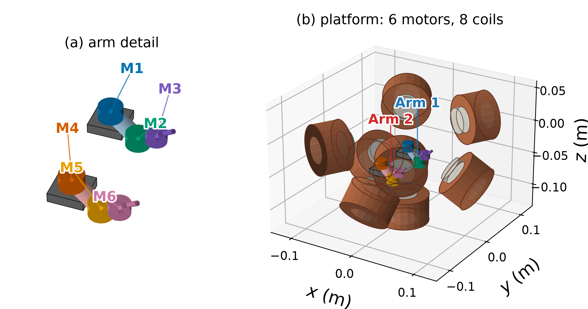
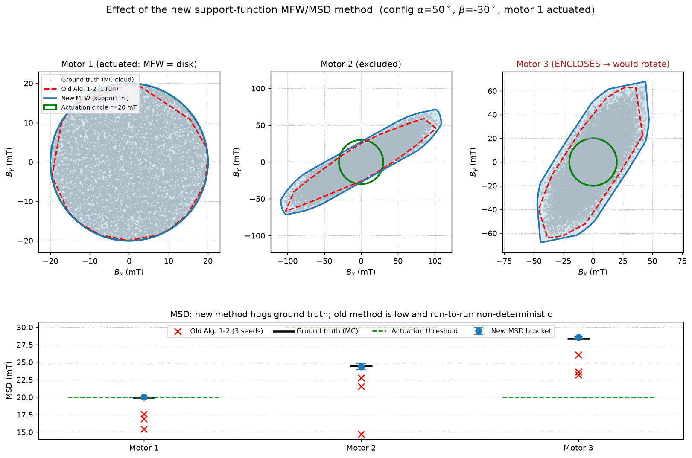
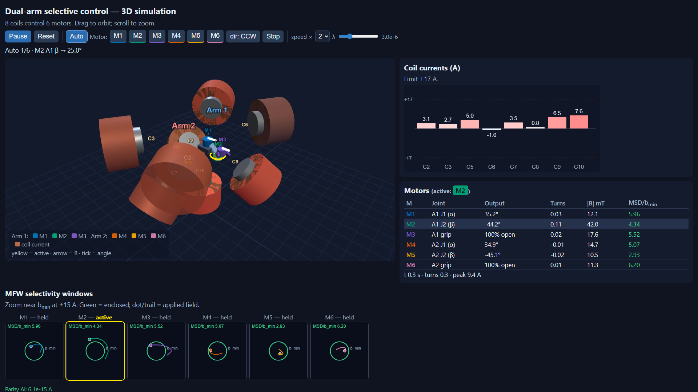
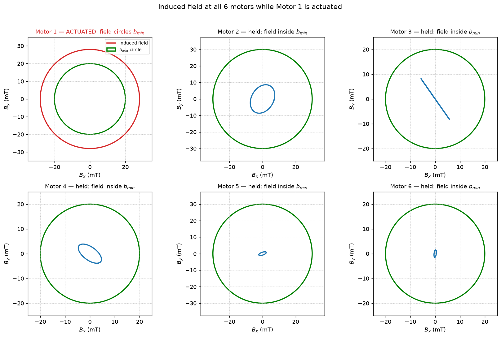
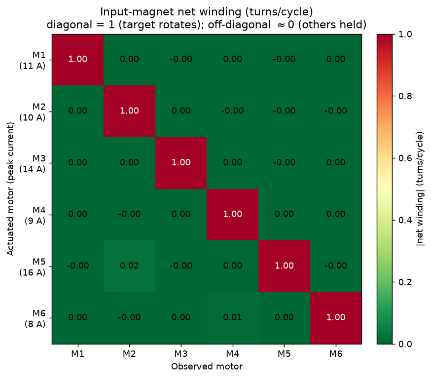
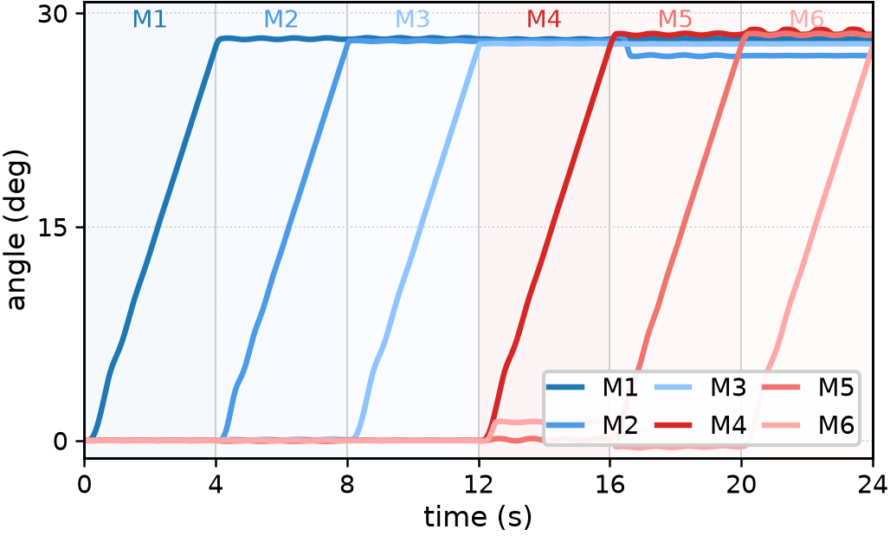
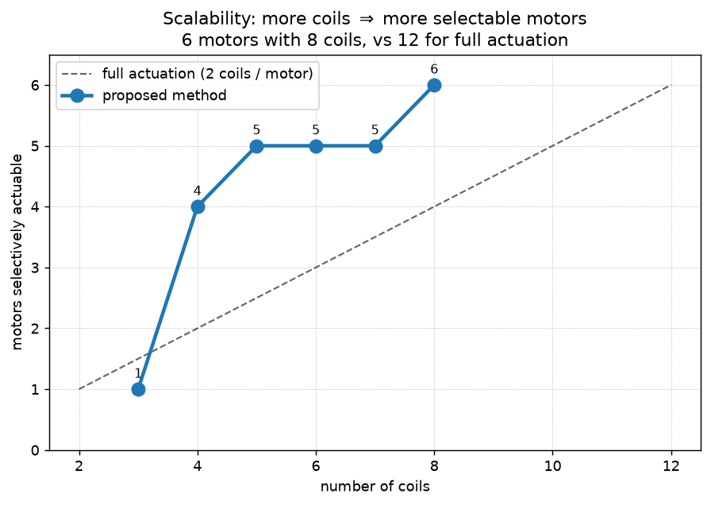
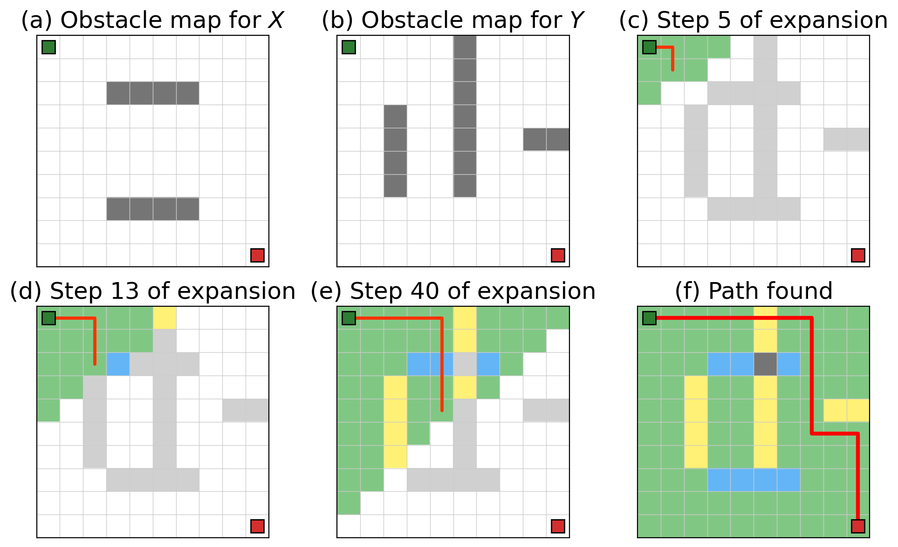

# Selective Electromagnetic Control of Multiple Magnetic Motors

This repository accompanies the IROS 2026 paper **"Selective Electromagnetic
Control of Multiple Millimeter-sized Magnetic Motors with Limited Number of
Coils"** (Da Zhao, Jiewen Tan, Hongzhe Sun, and Shing Shin Cheng, CUHK).

The work studies **selective electromagnetic actuation**: driving one
millimeter-scale magnetic motor while keeping neighboring, mechanically
identical motors below their rotation thresholds. Sharing the same coil array
across multiple motors reduces the hardware requirement—for example, three
motors can be selectively controlled with three coils instead of the six or
more required for simultaneous planar actuation.

The scientific core is a workspace analysis based on Magnetic-Feasible
Workspaces (MFWs), Current-Feasible Workspaces (CFWs), and the Minimal
Supporting Distance (MSD). These tools identify configurations where a rotating
field can actuate the selected motor without producing sustained rotation at
the others.



*The dual-arm case study uses two 3-DOF arms: motors **M1–M3** form Arm 1 and
**M4–M6** form Arm 2. Each arm has two revolute joints and a gripper, with every
joint driven through a 1:50 gearbox. The complete platform uses eight coils to
selectively control the six motors.*

## Installation

```bash
pip install -r requirements.txt
```

`pypoman` is needed only by the retained legacy polytope path and its
visualizations. It depends on `pycddlib`, which requires the **cddlib** C library
and GMP. On macOS: `brew install cddlib gmp`; on Debian/Ubuntu:
`apt install libcdd-dev libgmp-dev`.

## Layout

```
selective_em/   importable core library (the algorithms)
scripts/        runnable experiments that produce the paper's artifacts/figures
data/           generated CSV outputs (field targets, planned path, coil currents)
figures/        generated PNG figures
archive/        pre-refactor exploration scripts (unmaintained; see archive/README.md)
```

### Core library (`selective_em/`)

| Module | Contents |
|---|---|
| `coils` | Calibrated 10-coil parameters (single source of truth) + named subsets |
| `field_model` | Dipole field model; actuation matrix `A = map_i2b` |
| `workspace` | Deterministic support-function MFW/MSD analysis plus legacy polytope methods |
| `kinematics` | `robot_arm_kinematics` — the 3-DOF arm forward kinematics |
| `feasibility` | OAR / Influence Region / selectivity theorem |
| `control` | Per-step current solving for a rotating field |
| `planner` | Dual-layer axial A* (Algorithm 3) |
| `visualization` | MFW, CFW, and polytope plotting |

## Code ↔ paper terminology

| Paper term | Code |
|---|---|
| Actuation matrix `A(p)` | `field_model.map_i2b` (+ `extract_map_i2b`) |
| Magnetic-Feasible Workspace (MFW) | `workspace.get_mfw` (box) / `workspace.mfw_support` (selective) |
| Minimal Supporting Distance (MSD) | `workspace.minimal_supporting_distance`, `workspace.mfw_support` (bracketed) |
| Support-function MFW/MSD, **revised Algorithm** (replaces old Alg. 1–2) | `workspace.mfw_support`, `workspace.cfw_support`, `workspace.mfw_encloses_circle` |
| CFW polytope / MFW-from-CFW, **old Alg. 1–2** (superseded; kept for review) | `workspace.get_cfw_polytope`, `workspace.transform_and_extract_facets` |
| Omni-Actuation Region (OAR) | `feasibility.in_oar` |
| Influence Region (IR) + selectivity theorem | `feasibility.is_selectively_actuable` |
| Dual-layer axial A*, **Algorithm 3** | `planner.a_star` |
| Per-step selective controller | `scripts/run_field_optimization.py` |

The revised **support-function MFW/MSD** replaces the old vertex-enumeration
Algorithms 1–2. It hugs a Monte-Carlo ground truth to within <1 %, whereas the old
pair under-estimated the MSD by 8–40 % and was non-deterministic for >2 constrained
dimensions — enough to flip a selectivity classification at some configurations
(`scripts/compare_mfw_methods.py`):



## Coil configurations

`selective_em.coils` holds all 10 calibrated coils and the named subsets each
experiment uses (this replaces the old habit of commenting lines in/out):

- `WORKSPACE_COILS` (coils 7–10) — workspace/feasibility analysis (the default).
- `EXPERIMENT_COILS` (coils 2, 3, 7) — the 3-coil / 3-motor demonstration.
- `FULL_ARRAY` (all 10) — calibration and control-sequence generation.

Helpers accept an explicit `coils=` argument, so one import serves any subset.

## Dual-arm case study

Case Study II tests whether selective control remains practical as the system
grows from one arm to two. The platform contains six magnetic motors but
energizes only eight of the ten calibrated coils; independent planar actuation
would conventionally require twelve coils.

At each control stage, one motor tracks a rotating planar magnetic field while
the coil currents are chosen to suppress spillover at the other five motors.
The simulation integrates the rotational dynamics of every input magnet,
including inertia, viscous damping, the minimum actuation field `b_min`, and the
1:50 gearbox. Sustained winding moves an output joint, whereas bounded
oscillation at a held motor produces negligible output motion.

The automatic sequence drives the two high-threshold elbow motors first and
then completes the remaining joints. This ordering keeps the peak coil current
within the 17 A hardware limit.

### Interactive simulation

[**`arm_control_sim.html`**](arm_control_sim.html) is a self-contained,
offline Three.js simulation generated by `scripts/make_control_html.py`. It
ports the Python dipole model, spillover-minimizing controller, and geared-motor
dynamics to JavaScript.

The interface provides:

- an orbitable 3D view of both arms and the eight-coil operating set;
- live coil-current bars and per-motor joint, field, winding, and MSD values;
- compact `b_min` selectivity windows showing the applied-field dot and trail;
- automatic and manual motor control, plus a Python/JavaScript parity check.



*Current view of the standalone simulator. The active motor is highlighted in
yellow; the lower windows focus on each motor's `b_min` circle and applied
field.*

### Static case-study results

`scripts/case_study_dualarm.py` runs the same six-motor model headlessly and
generates the paper-style figures and `data/dualarm_case_study.csv`.

When one motor is actuated, its field is driven around a circle larger than its
rotation threshold, while the other motors remain inside their threshold
circles:



The net-winding matrix reports approximately one turn per cycle on the diagonal
and approximately zero off-diagonal:



During sequential actuation, each motor rotates only in its assigned time slot:



Adding coils increases the number of selectively actuable motors and remains
below the two-coils-per-motor cost of full planar actuation:



## Configuration-space planning

The dual-layer axial A* planner uses direction-dependent feasibility maps and
constructs an axis-aligned path through joint configuration space:



## Running the experiments

Each script opens a matplotlib figure (blocking) and/or writes to `data/` or
`figures/`. Run from the repo root:

```bash
python scripts/plot_oar_map.py --mode single    # single-target OAR map
python scripts/plot_oar_map.py --mode multi      # 3-motor OAR over joint angles
python scripts/plot_cfw_mfw.py                   # selectivity figure (paper Fig. 10)
python scripts/plot_influence_region.py          # spatial influence/actuation map
python scripts/compute_feasibility_maps.py --motor 1   # per-motor feasibility map (1|2|3)
python scripts/plan_path.py                      # feasibility maps + A* -> data/path_result.csv
python scripts/plan_path.py --demo               # fast synthetic-obstacle A* demo
python scripts/visualize_planner_steps.py        # -> figures/planner_process.png
python scripts/generate_control_sequence.py      # -> data/field_targets.csv + 3D preview
python scripts/calibrate_coils.py                # unconstrained current tracking (10 coils)
python scripts/run_field_optimization.py         # selective SLSQP controller (3 coils)
python scripts/compare_mfw_methods.py            # -> figures/mfw_method_comparison.png
python scripts/case_study_dualarm.py             # 6-motor/8-coil case study -> figures/dualarm_*.png
python scripts/make_control_html.py              # -> arm_control_sim.html (interactive 3D sim)
```

The feasibility/planning scripts are CPU-heavy (parallelized with
`multiprocessing`).
